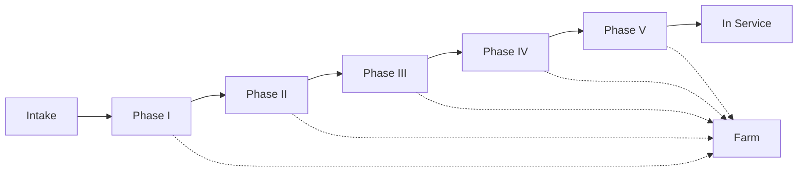

<div align="center">
  
  
  
</div>

# 🐕 Animal Rescue Tracker 🐒

## 📋 Project Overview

The **Animal Rescue Tracker** is an enterprise-grade application developed for **Grazioso Salvare**, an international search-and-rescue animal training organization. This system enables efficient tracking, management, and deployment of rescue animals that are trained to assist humans in critical and life-threatening situations.

<div align="center">

| Project Status | Last Updated | Minimum Java Version |
|:-------------:|:------------:|:--------------------:|
| Production | June 1, 2025 | Java 8 |

</div>

## 🌟 Key Features

- **Comprehensive Animal Management**: Track complete lifecycle of rescue animals from intake through training to deployment
- **Multi-species Support**: Fully supports both canine and primate rescue animals
- **Training Phase Tracking**: Monitor animal progress through standardized training phases
- **Reservation System**: Manage animal reservations for service in different countries
- **Reporting Capabilities**: Generate detailed reports filtered by animal type and status
- **Input Validation**: Robust validation for all user inputs to ensure data integrity

## 🏗️ Architecture

The application follows object-oriented design principles with a clear inheritance hierarchy:

```
RescueAnimal (Base Class)
├── Dog
└── Monkey
```

### 📦 Class Structure

#### `RescueAnimal` Class
Base abstract class providing common functionality for all rescue animals:
- **Attributes**: name, animalType, gender, age, weight, acquisitionDate, acquisitionCountry, trainingStatus, reserved, inServiceCountry
- **Methods**: Comprehensive getters and setters for all attributes

#### `Dog` Class
Extends `RescueAnimal` with canine-specific attributes:
- **Additional Attributes**: breed
- **Methods**: Breed-specific getters and setters

#### `Monkey` Class
Extends `RescueAnimal` with primate-specific attributes:
- **Additional Attributes**: species, tailLength, height, bodyLength
- **Methods**: Species validation, primate-specific getters and setters
- **Eligible Species**: Capuchin, Guenon, Macaque, Marmoset, Squirrel monkey, Tamarin

#### `Driver` Class
Main application controller that provides:
- Interactive command-line interface
- Menu-driven user experience
- Animal intake processing
- Reservation management
- Reporting functionality

## 🔄 Training Status Workflow

Animals progress through a standardized training pipeline:

<div align="center">



</div>

1. **Intake**: Initial assessment and onboarding
2. **Phase I-V**: Progressive training stages with increasing complexity
3. **In Service**: Successfully completed training and available for deployment
4. **Farm**: Redirected from training pipeline due to unsuitability

## 🚀 Getting Started

### Prerequisites
- Java Development Kit (JDK) 8 or higher
- Command-line terminal

### Installation

1. Clone the repository:
   ```bash
   git clone https://github.com/imjvdn/Animal-Rescue-Tracker.git
   ```

2. Navigate to the project directory:
   ```bash
   cd Animal-Rescue-Tracker
   ```

3. Compile the Java files:
   ```bash
   javac *.java
   ```

4. Run the application:
   ```bash
   java Driver
   ```

### Testing

Run the comprehensive test suite to verify functionality:

```bash
java TestAnimalRescueTracker
```

## 📊 Usage Examples

### Adding a New Dog
```
[1] Intake a new dog
> Enter the dog's name: Rex
> Enter the dog's breed: German Shepherd
> Enter the dog's gender (male/female): male
...
```

### Adding a New Monkey
```
[2] Intake a new monkey
> Enter the monkey's name: George
> Enter the monkey's species: Capuchin
> Enter the monkey's gender (male/female): male
...
```

### Reserving an Animal
```
[3] Reserve an animal
> Enter animal type (dog/monkey): dog
> Enter the country where the animal is in service: United States
...
```

## 🛠️ Development Guidelines

- **OOP Principles**: Adhere to encapsulation, inheritance, and polymorphism
- **Code Quality**: Maintain clean, readable, and well-documented code
- **Input Validation**: Implement thorough validation for all user inputs
- **Error Handling**: Provide clear error messages and graceful error recovery
- **Documentation**: Include comprehensive JavaDoc comments for all classes and methods
- **Testing**: Create unit tests for all functionality

## 📝 Git Workflow

This project follows a structured Git workflow:

1. `main` branch: Production-ready code
2. `develop` branch: Integration branch for feature development
3. Feature branches: Individual feature development (e.g., `feature/monkey-class`)

## 👥 Contributors

- **Jadan Morrow** - Lead Developer

## 📄 License

This project is proprietary software developed for Grazioso Salvare by Global Rain. All rights reserved.

---

<div align="center">
  <p>© 2025 Global Rain. All Rights Reserved.</p>
  <p>
    <a href="https://github.com/imjvdn/Animal-Rescue-Tracker/issues">Report Bug</a> ·
    <a href="https://github.com/imjvdn/Animal-Rescue-Tracker/issues">Request Feature</a>
  </p>
</div>
